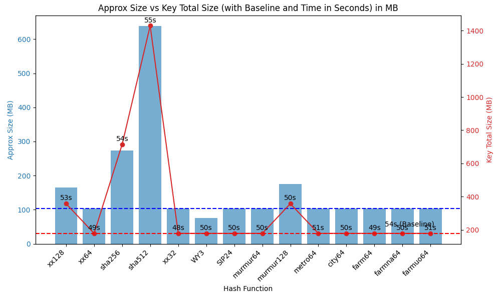

# Labels Store (Hash Functions)

When using Rocks DB with the `StoreFmtByHash` storage format setting, we can specify the hashing function that we use.

Whenever possible we are making use of zero allocation hashing functions in order to improve the performance - by reducing the memory overhead; and be deterministic. 

## Application

We currently consider the hashing functions in three flavours depending on the library from which they are obtained and the size of the output generated.
- Base Functions - these are sourced from Google's own hashing functions
- Long Functions - these are traditionally 64 bit functions the output of whom can be stored in a long value.
- Long Tuple Functions - these are larger hash functions with outputs that exceed that of a single long - i.e. 128, 256 or 512 bit. 

## Execution
- We split the triples into their individual nodes
- Each node is translated into a string.
  - Literals are cast directly to String
  - ANY nodes become "*"
  - All other Nodes have their URI retrieved
- The string is hashed by the chosen function and converted into bytes
- The bytes are concatenated and used as the key.

#### \* Special difference
For the hashes that return Long values, in order to save some space. We check to see if the value can be stored as an int, a short or even a byte instead of a long.

## Configuration sample
```
authz:labelsStore [
            authz:labelsStorePath "<PATH>" ;
            authz:labelsStoreByHash true ;
            authz:labelsStoreByHashFunction "<FUNCTION>" ;
 ] ; 
```
Where `<PATH>` is the location of the physical label store. For example, `"/Users/rdfuser/data/RDF/labels.db"`.

And `<FUNCTION>` is the configuration key of the required function below. For example, `"metro64"`.

#### *Notes:*
You will need to enable hashing by setting the `labelsStoreByHash` property. 

Also, if no function, or a missing name, is provided - the default `"XX128"` will be used.  

## Available Functions

### XX
[XX Hash](https://xxhash.com/) is an extremely fast non-cryptographic hash algorithm used by a number of technologies including Rocks DB itself. 

We have three variants: 32, 64 & 128 bits.

**_Config Keys :_** "xx32", "xx64", "xx128"

### City
[City Hash](https://github.com/google/cityhash) is a hashing function created by Google. 

We currently only have a 64-bit offering of the function.

**_Config Key :_** "city64"

### Farm
[Farm Hash](https://github.com/google/farmhash) is another hashing function created by Google.
There exist two other variants: UO and NA. 

All are 64-bit offerings.

**_Config Keys :_** "farm64", "farmna64", "farmuo64"

### SHA
[SHA](https://en.wikipedia.org/wiki/SHA-2) is a collection of cryptographic hashing functions designed by the National Security Agency. 

Due to their cryptographic nature they are slower and take up more space as a consequence.  

**_Config Keys :_** "sha256", "sha512"

### Murmur
[Murmur Hash](https://en.wikipedia.org/wiki/MurmurHash)  is a non-cryptographic hash function that was created alongside [SM Hasher](https://github.com/aappleby/smhasher), a test-suite created explicitly to test hash functions. 

**_Config Keys :_** "murmur64" ,"murmur128"

### Metro
[Metro Hash](https://github.com/jandrewrogers/MetroHash) is based upon City Hash written by [J. Andrew Rodgers](https://www.jandrewrogers.com/2015/05/27/metrohash/).
It is advertised to be 50% faster at bulk hashing than City and 15% faster with small keys. 

We currently only have a 64-bit offering of the function.

**_Config Keys :_**  "metro64"

### SIP 24
[SIP Hash](https://en.wikipedia.org/wiki/SipHash) is an add-rotate-xor based pseudo-random hashing function.
We currently only have a 64-bit offering of the function.

**_Config Keys :_**  "sip24"

### WY3
[WY Hash](https://github.com/wangyi-fudan/wyhash) is a Pseudorandom number generator and non-cryptographic hash function.

We currently only have a 64-bit offering of the function.

**_Config Keys :_**  "wy3"

## Anecdotal Performance runs

### Data / set-up
In order to compare the various hashing functions, limited by my local laptop, we will load 7,807,461 triples - all with the same label. There are a number of duplicate entries with 3,538,822 unique triples.  
Due to the manner in which we encode the data the value size will always be the same (70,267,149 bytes = 67Mb).

What remaining statistics that are of value are:
- time taken (in seconds)
- approximate size (in bytes/MB)
- total size of keys stored (in bytes/MB)
- physical size of label store on disk (in bytes/MB)

### Base Run
Using the existing ByString storage format to establish a baseline. It took 54 seconds to run and used 178Mb to store the keys generated.

### Performance Chart


### Data Table
| Hash Function | Approx Size (bytes) | Approx Size (MB) | Key Total Size (bytes) | Key Total Size (MB) | Time (seconds) |
|---------------|---------------------|------------------|------------------------|---------------------|----------------|
| baseline      | 108,894,887         | 103.89           | 187,379,064            | 178.73              | 54             |
| xx128         | 172,439,148         | 164.46           | 374,758,128            | 357.46              | 53             |
| xx64          | 108,953,975         | 103.92           | 187,379,064            | 178.73              | 49             |
| sha256        | 287,267,974         | 273.86           | 749,516,256            | 714.36              | 54             |
| sha512        | 669,055,747         | 637.96           | 1,499,032,512          | 1,429.93            | 55             |
| xx32          | 108,881,516         | 103.85           | 187,379,064            | 178.73              | 48             |
| WY3           | 78,534,452          | 74.91            | 187,379,064            | 178.73              | 50             |
| SIP24         | 108,941,136         | 103.91           | 187,379,064            | 178.73              | 50             |
| murmur64      | 108,860,083         | 103.83           | 187,379,064            | 178.73              | 50             |
| murmur128     | 183,673,470         | 175.12           | 374,758,128            | 357.46              | 50             |
| metro64       | 108,396,684         | 103.38           | 187,379,064            | 178.73              | 51             |
| city64        | 108,547,207         | 103.54           | 187,379,064            | 178.73              | 50             |
| farm64        | 108,872,200         | 103.86           | 187,379,064            | 178.73              | 49             |
| farmna64      | 108,931,513         | 103.92           | 187,379,064            | 178.73              | 50             |
| farmuo64      | 108,894,887         | 103.89           | 187,379,064            | 178.73              | 51             |


### Conclusion
So WY3 was the smallest in terms of memory footprint and the XX suite were the fastest - the 32 & 64 bits being 1st and 2nd respectively. 