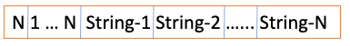
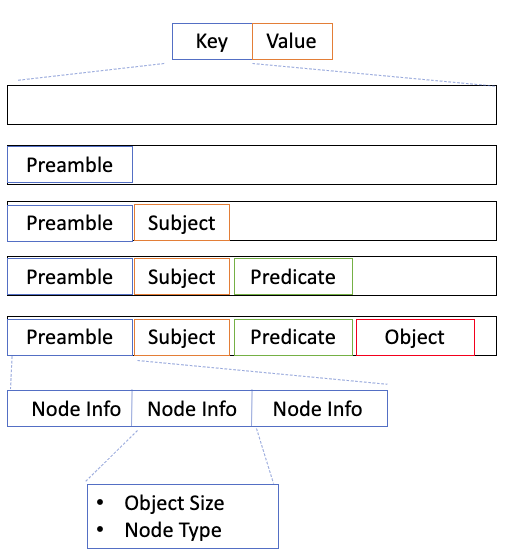

# Rocks DB Storage Formats
As mentioned in the accompanying Rocks DB [documentation](abac-rocksdb-label-store.md), 
Labels are stored in key/value pairs as byte arrays, with the key derived from the 
given RDF Triple and the value from the relevant ABAC Label.
---
## Values
For the value, Labels are represented as a list of Strings and are directly converted 
into bytes and stored in a array.

### Encoding Process
1. An integer representing the number of strings (N) in the list is stored at the front of the buffer.
2. The next N values are integers representing the sizes of the subsequent strings.
3. Each string is converted to bytes and allocated sequentially in the buffer.
### Decoding Process
The process is reversed.
1. We decode the first value - an integer; to determine how many strings we are dealing with (N).
2. We decode the next N values into a list of sizes.
3. We decode each of the N strings sequentially according to the given size. 
4. We return the generated list of strings.

---

## Keys
For keys, the generating/decoding process is more complicated and executed by 
classes implementing the Storage Format [interface](../rdf-abac-core/src/main/java/io/telicent/jena/abac/labels/StoreFmt.java)

## Storage Format Interface
The interface has only two methods:
- create Encoder 
- create Parser

And as the names suggest these create classes to encode a triple, node or 
string into the given key and a complimentary classes to decode the key back 
into it's constituent triple, node or string.   

These classes in turn, have methods relating to the encoding/decoding of those values. 
### Encoder (Interface)
- format Single Node 
- format Strings
- format Triple

The methods above take a Node, list of Strings or a triple and encode each into a byte array. 

### Parser (Interface)
- parse Single Node
- parse Triple
- parse Strings

Similarly, the methods above take a byte array and decode it back into a Node, 
list of Strings or a Triple.

---

## Keys - By String
### Overview
The [StoreFmtByString class](../rdf-abac-core/src/main/java/io/telicent/jena/abac/labels/StoreFmtByString.java) 
provides a straightforward approach to encoding and decoding RDF nodes and 
triples by converting them to and from strings. This approach balances simplicity 
and efficiency, making it ideal for scenarios where human-readable storage formats 
are preferred or when simplicity is a priority.

### Process 
#### Encoding Keys
For encoding Triples into keys is as illustrated

1. The existing byte buffer is cleared.
2. Space is allocated for the Preamble (15 bytes)
3. The subject node is encoded into bytes, written into the buffer with its size and node type recorded.
4. The predicate node is encoded into bytes, written into the buffer with its size and node type recorded.
5. The object node is encoded into bytes, written into the buffer with its size and node type recorded.
6. The information on the three nodes is encoded into bytes and written in to the space allocated at the start (5 bytes each). 

#### Decoding Keys
The process is reversed.
1. Decode the start of the retrieved Byte Buffer into 3 Node Info classes.
2. From each Node Info, 
   1. take the size to decode the relevant buffer section into a string
   2. take the type to determine which Node to populate from the string.
3. Return the generated Triple

### Detailed Explanation
The high level description above covers the general process but not how individual nodes are encoded or decoded.

#### Node Encoding Process 
THe process of encoding a node is broken down into the following steps:
1. **Type Identification**: Each node is identified by its type (URI, Literal, Blank, Any).
2. **String Representation**: Nodes are converted to their string representations based on that type.
3. **String Formatting**: The string is then formatted to include type markers and encoded into bytes.
4. **Triple Encoding**: A triple (subject, predicate, object) is encoded by individually encoding each node in the triple as described above.

#### Node - Type Identification
The encoding process begins by identifying the node type using the NodeType class. 
The node can be of type:
- **URI**: A Uniform Resource Identifier.
- **Literal**: A value or string.
- **Blank**: An anonymous node.
- **Any**: A wildcard node, represented by the asterisk (*) character.

#### Node - String Representation
Depending on the node type, the node is converted into its corresponding string representation:
- **URI**: Encoded directly as a string.
- **Literal**: Encoded with an appropriate prefix or suffix to distinguish it.
- **Blank**: Encoded with a prefix indicating its anonymous nature.
- **Any**: Simply represented by an asterisk (*).

#### Node - String Formatting
The node’s string representation is then formatted to include a type marker. For example:
- **URI**: "u:<URI_String>".
- **Literal**: "l:<Literal_String>".
- **Blank**: "b:<Blank_Node_String>".
- **Any**: '*'.

### Node - Triple Encoding
For triples, each node in the triple (subject, predicate, object) is individually encoded as a string and stored sequentially in the byte buffer.

### Decoding Process
#### Node Decoding Process
1. **Byte Extraction**: The stored bytes are read and converted back to a string.
2. **Node Type Identification**: The node type is determined from the string format.
3. **String Decoding**: The string is decoded back to its original node form.
4. **Triple Decoding**: The process is repeated for each node in the triple.

#### Node - Byte Extraction
The decoding process starts by extracting the byte array from the storage buffer. This byte array is then converted back into a string.
Node Type Identification:

The node type is determined by examining the prefix or marker in the string. For instance:
- **"u:"** indicates a URI.
- **"l:"** indicates a Literal.
- **"b:"** indicates a Blank node.
- **"*"** indicates an Any node.

#### Node - String Decoding
The string, now identified by its type, is decoded back into its original node form. This involves stripping off the type marker and reconstructing the node from the remaining string.

#### Node - Triple Decoding
The process is repeated for each node in a triple, resulting in the reconstruction of the original subject, predicate, and object nodes.

---
## Keys - By ID
### Overview
The [StoreFmtById class](../rdf-abac-core/src/main/java/io/telicent/jena/abac/labels/StoreFmtById.java)
 uses an ID-based approach to convert nodes to Node-IDs and back again, optimizing storage efficiency. The IDs are generated by making use of Jena's Node Table class.

The downside being that the table is held in memory and so upon restart - the table is no longer available and thus the IDs are potentially invalidated.

Currently, there are only two different Node Table implementations available: Naive Node Table & Trie Node Table; which are described below.

### Encoding Process
1. **Node Type Encoding**: Each node is first classified into a type (URI, Literal, Blank, Any).
2. **ID Assignment**: Nodes are assigned a unique ID if they don’t have one already.
3. **Byte Formatting**: The node type and the ID are then encoded into a series of bytes.
4. **Triple Encoding**: A triple (subject, predicate, object) is encoded by encoding each node in the triple.

### Decoding Process
1. **Byte Extraction**: The stored bytes are read.
2. **Node Type Decoding**: The node type is extracted from the first byte.
3. **ID Decoding**: The ID corresponding to the node is decoded.
4. **Triple Decoding**: The process is repeated for each node in the triple.

### Detailed Explanation - Encoding Process
#### Node Type Encoding
The first step in encoding a node is determining its type. The NodeType class categorizes a node as one of the following:
- **URI**: Represents a Uniform Resource Identifier.
- **Literal**: Represents a value or string.
- **Blank**: Represents an anonymous node.
- **Any**: A special wildcard node.

#### ID Assignment
If the node type is not Any, the node is assigned a unique ID using the NodeTable. 
If the node already has an ID, that ID is used.

#### Byte Formatting
The top byte is composed by encoding the node type and the size of the node ID.
For nodes with an ID, the ID is encoded into the byte buffer after the top byte.

#### Triple Encoding
For triples, each node (subject, predicate, object) is individually encoded and stored in sequence in the byte buffer.

### Detailed Explanation - Decoding Process
#### Byte Extraction
The decoding process begins by extracting the first byte from the byte buffer, which contains information about the node type and ID size.
#### Node Type Decoding
The node type is decoded from the top bits of the first byte.
#### ID Decoding
If the node is not of type Any, the ID is decoded from the subsequent bytes based on the ID size determined from the first byte.
#### Triple Decoding
The process is repeated for each node in a triple, reconstructing the original nodes from their encoded forms.

### ID Generation

#### Naive Node Table
A simple implementation of NodeTable that stores nodes and their IDs in a concurrent hash map.
The ID is simply an incrementing of the number of entries in the hash map, in the form of a Node ID.

#### Trie Node Table
A more space-efficient implementation using a trie structure to store and retrieve node IDs.
The ID is generated by incrementing a number with the accompanying Node translated to a string and stored in a Trie Map.
